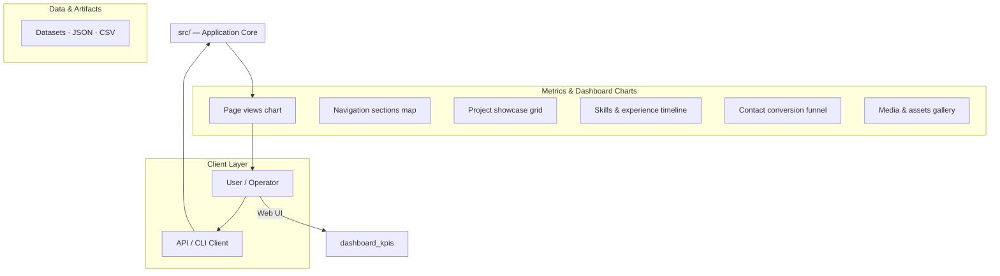
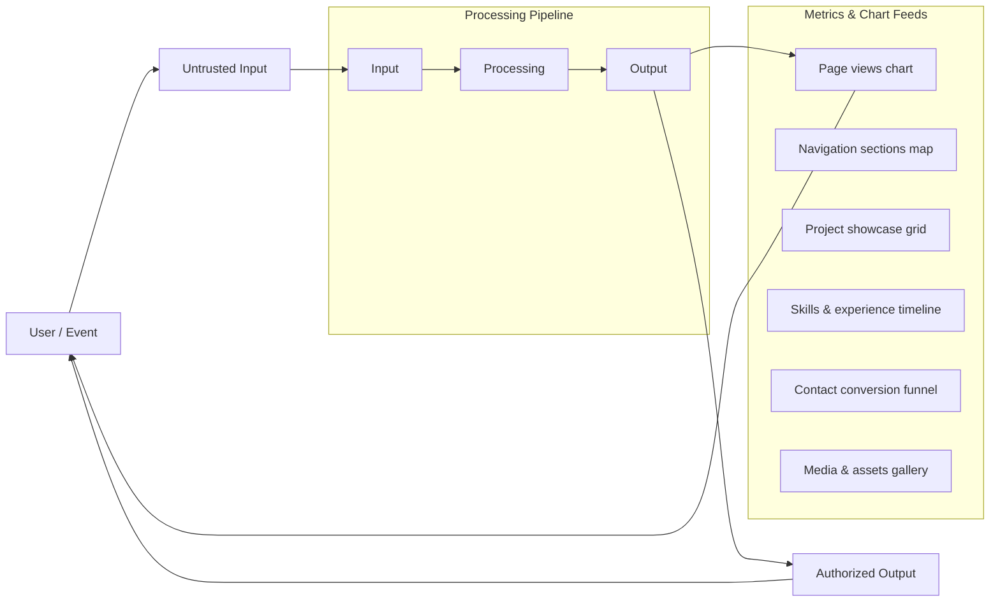
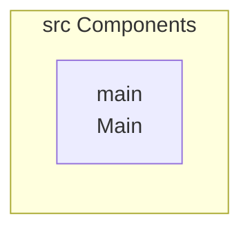
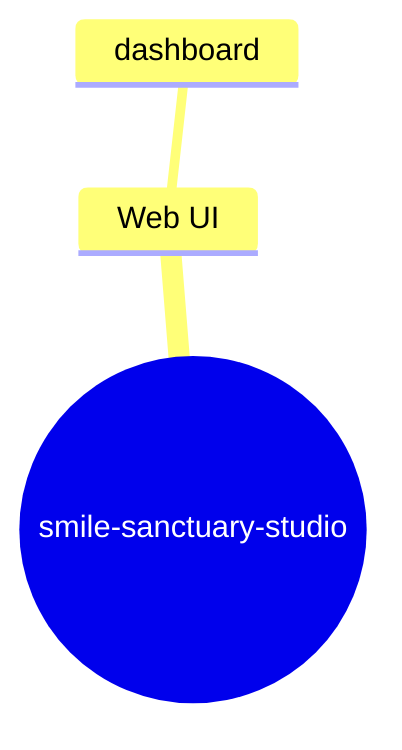
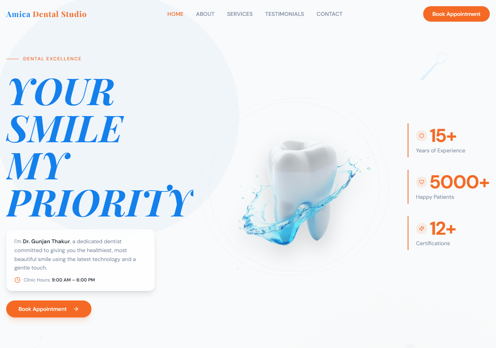

# ProjectUnderstanding

A modern web application built with React, TypeScript, and Tailwind CSS, following best practices for component-based development.

## Overview

This project is a contemporary web application designed using the React ecosystem. It leverages TypeScript for type safety and Tailwind CSS for utility-first styling, ensuring a highly maintainable and scalable codebase. The structure suggests a focus on component reusability, utilizing libraries like shadcn-ui and Radix UI components.

## Key Features

- Component-based architecture using React
- Type safety enforced via TypeScript
- Utility-first styling using Tailwind CSS
- Integration of accessible UI components (shadcn-ui/Radix UI)

## Technology Stack

- React
- TypeScript
- Tailwind CSS
- Vite
- shadcn-ui
- Radix UI

## Project Overview

This project is a modern web application built using the React ecosystem. It leverages TypeScript for robust type safety and Tailwind CSS for utility-first styling, ensuring a highly maintainable and scalable codebase. The design emphasizes component reusability, utilizing advanced libraries like shadcn-ui and Radix UI components.

### Key Features

*   **Component-based architecture** using React for modular development.
*   **Type safety** enforced via TypeScript, reducing runtime errors.
*   **Utility-first styling** using Tailwind CSS for rapid and consistent UI development.
*   **Integration of accessible UI components** (shadcn-ui/Radix UI) for best-in-class user experience.

## Tech Stack

This application utilizes a modern and robust set of technologies:

*   React
*   TypeScript
*   Tailwind CSS
*   Vite (Build Tool)
*   shadcn-ui
*   Radix UI

## Getting Started

To set up and run the project locally, follow these steps:

### Prerequisites

Ensure you have Node.js and npm installed.

### Installation

1.  **Clone the repository:**
    ```sh
git clone <YOUR_GIT_URL>
```

2.  **Navigate into the project directory:**
    ```sh
cd <YOUR_PROJECT_NAME>
```

3.  **Install all required dependencies:**
    ```sh
npm install
```

## Usage

### Development Mode

To run the application in development mode, which starts the local development server with auto-reloading:

```sh
npm run dev
```

This command will allow real-time viewing and testing of the application.

### Building for Production

To create an optimized production build:

```sh
npm run build
```

## Future Improvements

*   Adding detailed API documentation for any exposed endpoints.
*   Implementing comprehensive unit and integration tests.

## Limitations

*   No specific performance metrics or benchmarks are provided in the repository data.

## Setup Guide

### Frontend Setup

```bash

npm install
npm run dev     # development
npm run build && npm start   # production
```

Open `http://127.0.0.1:5173` (or the port shown in the terminal).

### Running the Application

1. **Start web app** — `npm run dev` in `./`

```bash
cd .
npm install
npm run dev
```

## System Architecture

High-level system design, data flows, API map, and workflow pipelines derived from the repository structure.

### System Architecture



### Data Flow & Charts Pipeline



### Component & API Map



### Application Page Map



## Application Pages

Screenshots captured from the running application. Each page is listed with its function.

### Application

#### Home

Home — application page at `/`


