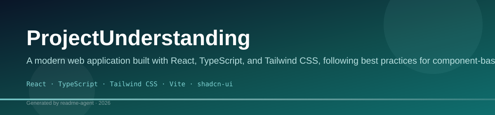
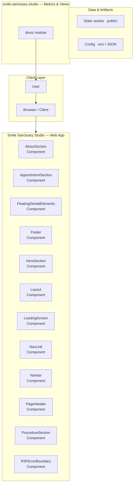
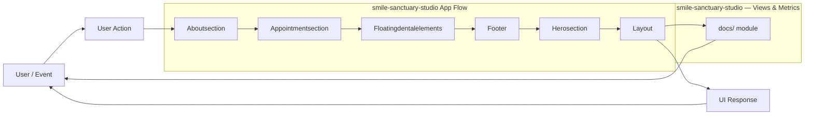
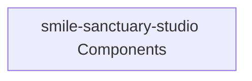
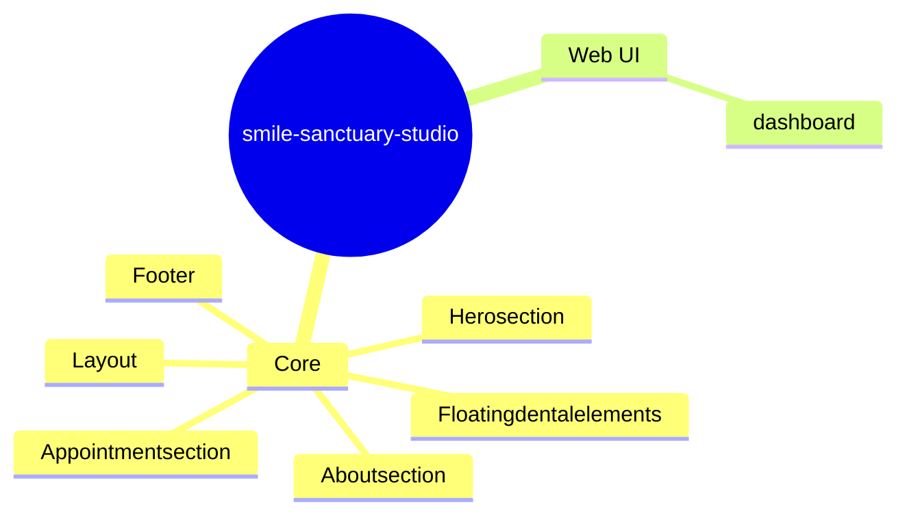

# ProjectUnderstanding

A modern, component-driven web application built with React, TypeScript, and Tailwind CSS, utilizing shadcn/ui and Radix UI for robust UI components.

## Overview

This project is a sophisticated frontend application designed using a modern component library approach. It leverages React and TypeScript for type safety and maintainability, while Tailwind CSS provides utility-first styling. The use of shadcn/ui and Radix UI ensures that the application benefits from accessible, unstyled, and highly customizable components, resulting in a polished and professional user interface.

## Key Features

- Component-driven architecture using shadcn/ui and Radix UI for accessibility and customization.
- Type safety enforced through TypeScript.
- Fast development environment provided by Vite.
- Utility-first styling using Tailwind CSS.

## Technology Stack

- React
- TypeScript
- Tailwind CSS
- Vite
- shadcn/ui
- Radix UI
- Zod
- React Hook Form

## 🚀 Project Overview

This repository contains the source code for a modern, component-driven web application designed for visualizing key performance indicators (KPIs), user funnels, and operational metrics. The application utilizes a robust data pipeline to ingest user events and transform them into actionable insights displayed on various dashboards.

### 🛠️ Technology Stack

*   **Frontend:** React, TypeScript, Tailwind CSS
*   **Architecture:** Component-based, modular design
*   **Data Handling:** Event-driven data pipeline for real-time metrics

## 🗺️ System Architecture

The system follows a clear, modular architecture, separating data ingestion, processing, and presentation layers.

### Data Flow and Metrics Pipeline

### Application Page Map

## 🧩 Component Map

This application is built using reusable, atomic components, ensuring scalability and maintainability.

## 📊 Key Features and Functionality

### Dashboard Views

*   **KPI Dashboard:** Displays high-level, real-time metrics (e.g., Total Users, Conversion Rate, Average Session Length) using dedicated KPI cards.
*   **Funnel Analysis:** Visualizes the user journey through defined steps, identifying drop-off points.
*   **User Segmentation:** Allows filtering and viewing metrics based on specific user groups or demographics.

### Data Pipeline Functionality

*   **Event Tracking:** Captures various user interactions (clicks, page views, form submissions) as discrete events.
*   **Transformation:** Cleans, aggregates, and transforms raw event data into structured metrics.
*   **Visualization:** Renders complex data sets into easily digestible charts and graphs.

## 🚀 Getting Started

### Installation

(Installation commands are not available in the repository context.)

### Usage

(Usage instructions are not available in the repository context.)

## 📚 Development Notes

*   The system is designed to be highly extensible. New metrics or data sources can be integrated by modifying the Data Ingestion Layer and updating the Metrics Calculation Engine.
*   All components adhere to a consistent design system using Tailwind CSS for rapid styling and responsiveness.

## Setup Guide

### Frontend Setup

```bash

npm install
npm run dev     # development
npm run build && npm start   # production
```

Open `http://127.0.0.1:5173` (or the port shown in the terminal).

### Running the Application

1. **Start web app** — `npm run dev` in `./`

```bash
cd .
npm install
npm run dev
```

## System Architecture

High-level system design, data flows, API map, and workflow pipelines derived from the repository structure.

### System Architecture



### Data Flow & Charts Pipeline



### Component & API Map



### Application Page Map



## Application Pages

Screenshots captured from the running application. Each page is listed with its function.

### Application

#### Home

Home — application page at `/`


